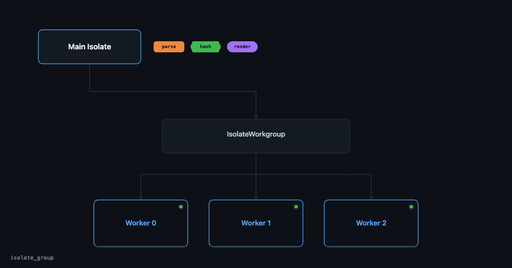
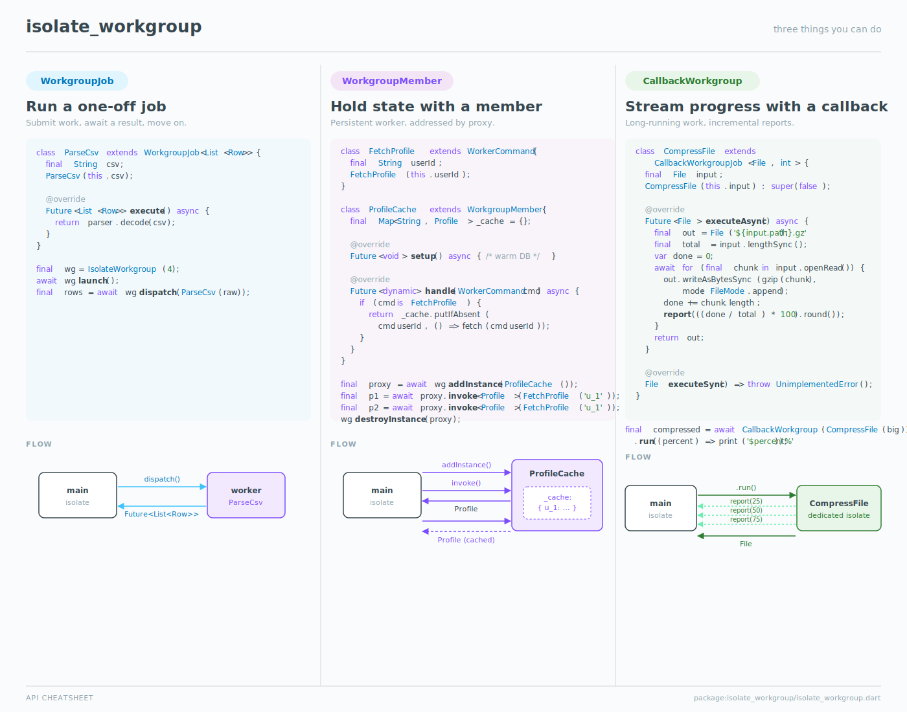
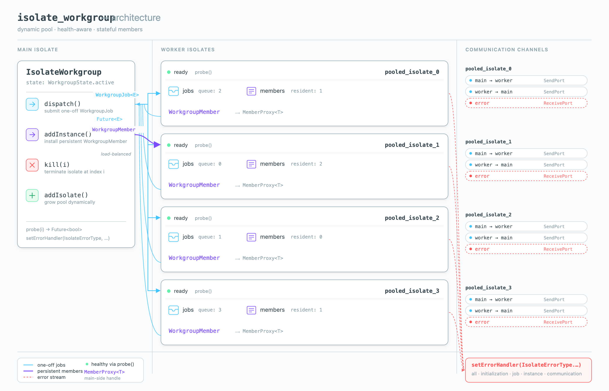

# Isolate Workgroup

<p align="center">
  
</p>

<p align="center">
  <a href="https://pub.dev/packages/isolate_workgroup"></a>
  <a href="https://dart.dev"></a>
  <a href="LICENSE"></a>
</p>

A dynamic pool of worker isolates for parallel processing in Dart — with
one-off jobs, persistent stateful members, runtime resizing, and
health-aware dispatch.

## Features

- **One-off jobs** via `dispatch()` — submit work, await a result.
  Like Flutter's `compute()` but without spawning a fresh isolate per call.
- **Persistent stateful members** via `addInstance()` + `MemberProxy.invoke()` —
  keep state (caches, open connections, etc.) inside a worker across many calls.
- **Progress callbacks** via `CallbackWorkgroup` —
  stream incremental updates from a long-running job.
- **Dynamic resizing** via `addIsolate()` and `kill()` —
  grow or shrink the workgroup at runtime; indices remain stable.
- **Health-aware** — built-in `probe()` and configurable
  `WorkgroupHealthConfig` (`disabled` / `aggressive` / `relaxed`).
- **Typed error routing** via `setErrorHandler(IsolateErrorType.…)` —
  separate channels for `job`, `instance`, `initialization`, `communication`,
  and a catch-all `all`.

## How it works

<p align="center">
  
</p>

The main isolate creates an `IsolateWorkgroup`. Jobs and members are
sent over `SendPort`s to whichever worker is free; results flow back
over the workers' return ports. For `WorkgroupMember`s, state stays
inside the worker, so subsequent calls hit a warm cache instead of
re-paying serialization costs.

## Quick start

```yaml
dependencies:
  isolate_workgroup: ^1.0.0
```

```dart
import 'package:isolate_workgroup/isolate_workgroup.dart';

void main() async {
  final wg = IsolateWorkgroup(4);
  await wg.launch();

  final result = await wg.dispatch(MyJob());
  print(result);

  wg.shutdown();
}

class MyJob extends WorkgroupJob<String> {
  @override
  Future<String> execute() async => 'hello from a worker isolate';
}
```

## API at a glance

<p align="center">
  
</p>

## Usage

### Run a one-off job

The workgroup accepts one-time requests (`WorkgroupJob`s) much like
Flutter's `compute()`, but reuses an existing worker from the pool
instead of spawning a fresh isolate. Subclass `WorkgroupJob`, declare
sendable fields, override `execute()`, and pass an instance to
`IsolateWorkgroup.dispatch()`.

```dart
import 'package:isolate_workgroup/isolate_workgroup.dart';

class ParseCsv extends WorkgroupJob<List<Row>> {
  final String csv;
  ParseCsv(this.csv);

  @override
  Future<List<Row>> execute() async => parser.decode(csv);
}

void main() async {
  final wg = IsolateWorkgroup(4);
  await wg.launch();

  final rows = await wg.dispatch(ParseCsv(raw));

  wg.shutdown();
}
```

### Hold state with a member

Create a `WorkgroupMember` to keep state inside a worker (a cache,
a database handle, an open socket). The main isolate gets back a
`MemberProxy` and calls `invoke()` with `WorkerCommand` descendants —
RPC-style messaging to the worker. Members are correlated by ID, so
many in-flight calls to the same member are demultiplexed
automatically.

```dart
import 'package:isolate_workgroup/isolate_workgroup.dart';

class FetchProfile extends WorkerCommand {
  final String userId;
  FetchProfile(this.userId);
}

class ProfileCache extends WorkgroupMember {
  final Map<String, Profile> _cache = {};

  @override
  Future<void> setup() async { /* warm DB, open files, etc. */ }

  @override
  Future<dynamic> handle(WorkerCommand cmd) async {
    if (cmd is FetchProfile) {
      return _cache.putIfAbsent(cmd.userId, () => fetch(cmd.userId));
    }
    return null;
  }
}

void main() async {
  final wg = IsolateWorkgroup(4);
  await wg.launch();

  final proxy = await wg.addInstance(ProfileCache());
  final p1 = await proxy.invoke<Profile>(FetchProfile('u_1'));
  final p2 = await proxy.invoke<Profile>(FetchProfile('u_1')); // cache hit

  wg.destroyInstance(proxy);
  wg.shutdown();
}
```

### Stream progress with `CallbackWorkgroup`

For long-running jobs that need to report progress, use
`CallbackWorkgroup`. Override `executeAsync()` (or `executeSync()`),
call `report(arg)` from inside the worker, and pass a callback to
`run()`.

```dart
import 'package:isolate_workgroup/isolate_workgroup.dart';

class CompressFile extends CallbackWorkgroupJob<File, int> {
  final File input;
  CompressFile(this.input) : super(false);

  @override
  Future<File> executeAsync() async {
    final out = File('${input.path}.gz');
    final total = input.lengthSync();
    var done = 0;
    await for (final chunk in input.openRead()) {
      out.writeAsBytesSync(gzip(chunk), mode: FileMode.append);
      done += chunk.length;
      report(((done / total) * 100).round());
    }
    return out;
  }

  @override
  File executeSync() => throw UnimplementedError();
}

final compressed = await CallbackWorkgroup(CompressFile(big))
    .run((percent) => print('$percent%'));
```

## Architecture

<p align="center">
  
</p>

The main isolate holds the `IsolateWorkgroup`. Each worker has three
ports: a *main → worker* `SendPort`, a *worker → main* `SendPort`, and
an *error* `ReceivePort` that surfaces uncaught failures back to your
registered handler. `dispatch()` fans jobs out to whichever worker is
free; `addInstance()` load-balances members onto the worker with the
fewest residents. `kill(i)` and `addIsolate()` resize the pool at
runtime without changing the indices of surviving workers.

## Best practices

See [BEST_PRACTICES.md](BEST_PRACTICES.md) for guidance on:
sizing the workgroup, choosing between `dispatch()` and `addInstance()`,
designing sendable payloads, avoiding closure-capture pitfalls, error
handling, when to enable health checking, and large binary transfers.

## License

BSD 3-Clause. See [`LICENSE`](LICENSE) for the full text.

## Contributing

See [`CONTRIBUTING.md`](CONTRIBUTING.md) for setup, workflow, and
code-style guidelines.

Inspired by https://pub.dev/packages/isolate_pool_2
